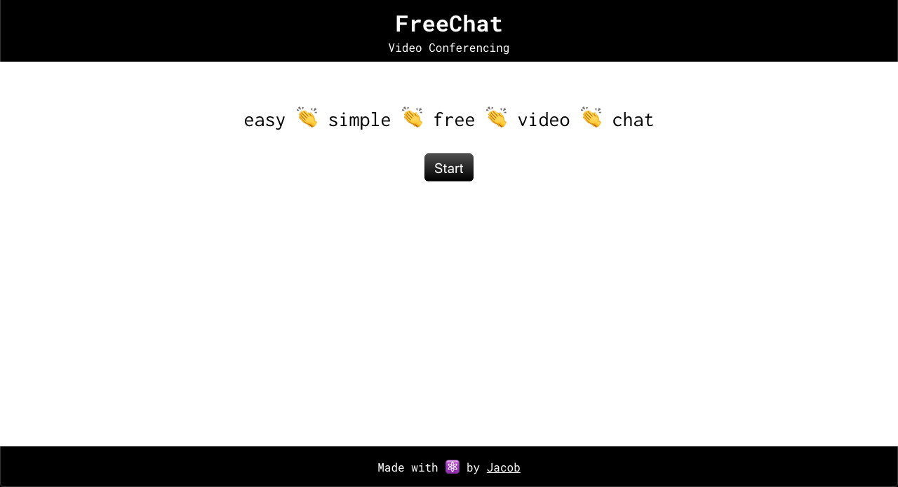
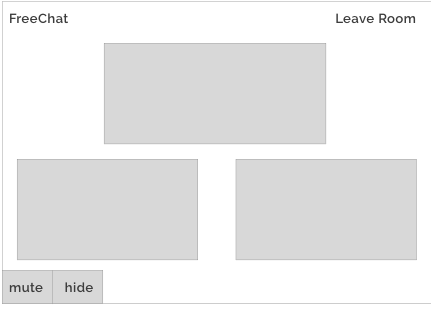
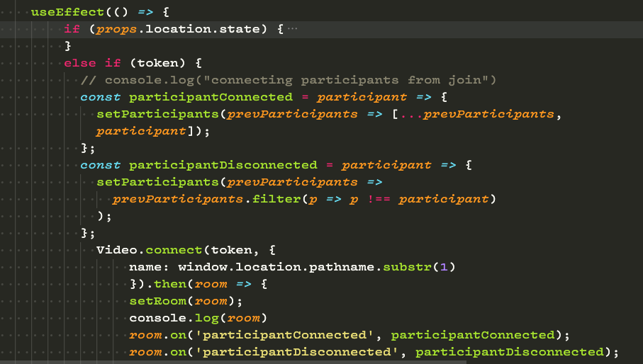
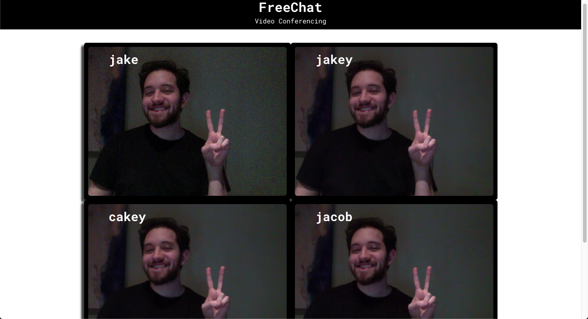

# Final Project 
## Jacob Kleiman 🌴
### SEI 08

<hr>

Title: FreeChat<br>
Technologies: React, Node.js, Twilio-Video, Sass<br>
Creator: Jacob Kleiman<br>
Goal: Implement a simple, easy, free, video chat
<hr>



<hr>

## The problem

With the current situation of the world right now (Covid-19), there is a high demand for video conferencing. A major issue I've observed is the issue of the entire onboarding and installation process. This web application proposes a solution that is to streamline the process of video conferencing, encrypted "rooms" for private and minimal accessibility.


## Planning
Over the intial days of the project, I worked on low to mid-fidelity wireframes, this process was one of the first things I did to ensure a feasible implementation and concept of design.

<hr>



<hr>


## The Video Stream

For my application I decided to use the video application programming interface from Twilio. In order to enable a user's audio and video with twilio, the application must use an ssl protocol (HTTPS) for security reasons.

<hr>



<hr>

## The Rooms and Participants with React Hooks and JWT

The rooms hold participants, each instance of a participant contains a ```<video>``` and ```<audio>```, as well as a display name, and room name. All of the information is stored within an encrypted jwt (json web token), the primary packets of information passed between the client and server.
I used React Hooks to streamline the process of manipulating the state, handling callbacks, as well as orchestrating the entire lifecycle of my Room component in a single useEffect function.

## The UI and Design

The visual concept behind my app is minimalistic. No bells and whistles to confuse the user, light button gradients, monospace typefaces (special thanks to Cat C). This was without the hardest front-end designs I ever implemented, due to the less is more concept that I pursued.

<hr>



<hr>
